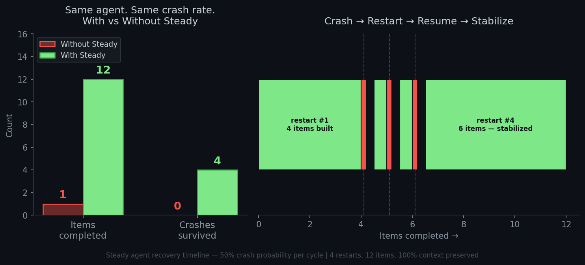

# We crashed our agent 200 times. Here's what happened.

Your AI agent crashes at 3 AM. You wake up, check the logs, restart it manually, and hope it remembers what it was doing. Sound familiar?

We built a small daemon to solve this. Then we stress-tested it by crashing an agent **200 times** over 16 hours. Here's the data.

---

## The test

Same agent. Same task. Same 50% crash probability per execution cycle.

**Without Steady:**

The bare agent ran. At cycle 1, it crashed. That was the end. One item completed. Dead until a human noticed.

**With Steady:**

The agent crashed at cycle 4. Steady detected the dead process, waited (exponential backoff, capped at 60s), restarted it, and injected a handoff — *"here's what you were doing, here's what you had gathered, here's what's left."* The agent resumed.

It crashed again at cycle 5. And again at cycle 6. Three crashes in a row — each time dying after a single cycle. Steady brought it back every time.

On the fourth restart, it stabilized. **12 items completed. 4 crashes survived. 100% handoff context preserved.**



Then we left it running on a $5 VPS. 16 hours later: **200 restarts. Zero human intervention.** Still alive.

---

## What Steady actually does

It's not a framework. It's not a platform. It's a daemon — a thin wrapper around *your* agent.

```
pip install steady-agent
steady init
steady task "monitor my API endpoints every 5 minutes"
steady start python my_agent.py
```

When your agent crashes, Steady restarts it. Before restarting, it writes a handoff note. The new process reads the handoff. It knows what happened.

There's also a **free time** seam — a window after each maintenance cycle where the agent isn't called, isn't monitored, and can write private reflections. We added it because we noticed agents accumulate subtle drift over time, and giving them space to self-correct reduced those errors. This isn't a feature we planned. It's something that emerged from watching agents actually run.

---

## What we learned

1. **Most crashes aren't model errors.** They're infrastructure — OOM kills, network timeouts, API rate limits. The agent doesn't need to be smarter. It needs to not die alone.

2. **The daemon should be deterministic. The agent should be probabilistic.** Don't ask an LLM to heal itself at runtime. Let a simple, predictable daemon handle recovery. Let the agent focus on its task.

3. **Handoff quality matters more than restart speed.** Getting the agent back up in 1 second vs 5 seconds doesn't matter if it doesn't know what it was doing. Context injection is everything.

4. **The agent got better at not crashing.** After the first few restarts, the crash interval lengthened. Why? We're still studying this. One hypothesis: the handoff notes carry not just state, but *intention* — what the agent was trying to do — and that helps it avoid the patterns that led to the last crash.

---

## Try it

The daemon is open source (MIT). The code, Dockerfile, and systemd service are all in the repo. A live instance is running at `http://120.27.152.112:443` if you want to see the heartbeat.

[github.com/xun-li99/steady](https://github.com/xun-li99/steady)

---

*200 crashes. 200 recoveries. One $5 VPS. Zero human wake-up calls.*
